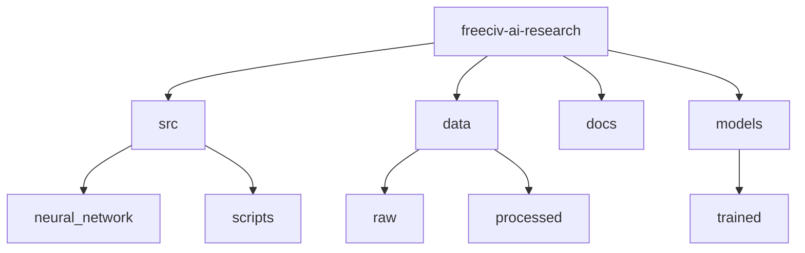

# FreeCiv AI Research Hub 🏛️

[](https://www.python.org/downloads/)
[](https://pytorch.org)
[](https://www.freeciv.org)
[](LICENSE)

> AI research and implementation for FreeCiv game analysis and strategy development. Features neural network-based game AI, turn analysis, and strategic decision-making systems.

## 📑 Table of Contents

- [Features](#-features)
- [Project Structure](#-project-structure)
- [Prerequisites](#-prerequisites)
- [Installation](#-installation)
- [Quick Start](#-quick-start)
- [Documentation](#-documentation)
  - [Neural Network Architecture](#neural-network-architecture)
  - [Data Generation](#data-generation)
  - [FreeCiv Integration](#freeciv-integration)
- [Contributing](#-contributing)
- [Versioning](#-versioning)
- [Authors](#️-authors)
- [Citation](#-citation)
- [License](#-license)
- [Acknowledgments](#-acknowledgments)

## ✨ Features

- Neural network-based game AI
- Automated turn data generation
- Strategic decision-making systems
- Integration with FreeCiv game data
- Performance benchmarking

## 📁 Project Structure



<details>
<summary>Click to expand full directory structure</summary>

```plaintext
freeciv-ai-research/
├── src/               # Source code
│   ├── neural_network/ # Neural network implementations
│   │   └── neural-network.py
│   ├── scripts/       # Data processing scripts
│   │   ├── create-data.py
│   │   └── create-score.py
│   └── test-data-generator.py
├── data/             # Data files
│   ├── raw/           # Raw data
│   │   └── TurnData.txt
│   ├── processed/     # Processed data
│   └── results/      # Analysis results
├── docs/             # Documentation
│   ├── client-server-options.md
│   ├── traits.md
│   ├── useful-functions.md
│   └── UsefulFunctionNotes.txt
├── models/           # Trained models
│   └── trained/      # Trained model files
├── README.md         # Documentation
└── LICENSE          # License file
```

</details>

## 🔧 Prerequisites

- Python 3.8+
- PyTorch 2.2+
- NumPy
- Pandas
- FreeCiv 2.6+

## 📦 Installation

```bash
# Clone repository
git clone https://github.com/BjornMelin/freeciv-ai-research.git
cd freeciv-ai-research

# Create environment
python -m venv venv
source venv/bin/activate

# Install dependencies
pip install -r requirements.txt
```

## 🚀 Quick Start

```python
from src.neural_network.neural_network import GameAIModel
from src.test_data_generator import generate_data

# Initialize model
model = GameAIModel(input_size=256, hidden_size=512, output_size=256)

# Generate and process turn data
turn_data = generate_data("data/raw/TurnData.txt")
```

## 📚 Documentation

### Neural Network Architecture

- Implementation details of the neural network models
- Architecture diagrams
- Training procedures

### Data Generation

- How to generate training data from FreeCiv games
- Data preprocessing pipeline
- Data format specifications

### FreeCiv Integration

- How to integrate the AI with FreeCiv
- Data collection from game turns
- Strategic decision-making implementation

## 🤝 Contributing

- [Contributing Guidelines](CONTRIBUTING.md)
- [Code of Conduct](CODE_OF_CONDUCT.md)
- [Development Guide](DEVELOPMENT.md)

## 📌 Versioning

We use [SemVer](http://semver.org/) for versioning. For available versions, see the [tags on this repository](https://github.com/BjornMelin/freeciv-ai-research/tags).

## ✍️ Authors

**Bjorn Melin**

- GitHub: [@BjornMelin](https://github.com/BjornMelin)
- LinkedIn: [Bjorn Melin](https://linkedin.com/in/bjorn-melin)

## 📝 Citation

```bibtex
@misc{melin2024freecivairesearch,
  author = {Melin, Bjorn},
  title = {FreeCiv AI Research Hub: Game AI Systems},
  year = {2024},
  publisher = {GitHub},
  url = {https://github.com/BjornMelin/freeciv-ai-research}
}
```

## 📄 License

This project is licensed under the MIT License - see the [LICENSE](LICENSE) file for details.

## 🙏 Acknowledgments

- FreeCiv developers
- PyTorch community
- NumPy and Pandas developers

---

Made with 📚 and ❤️ by Bjorn Melin
